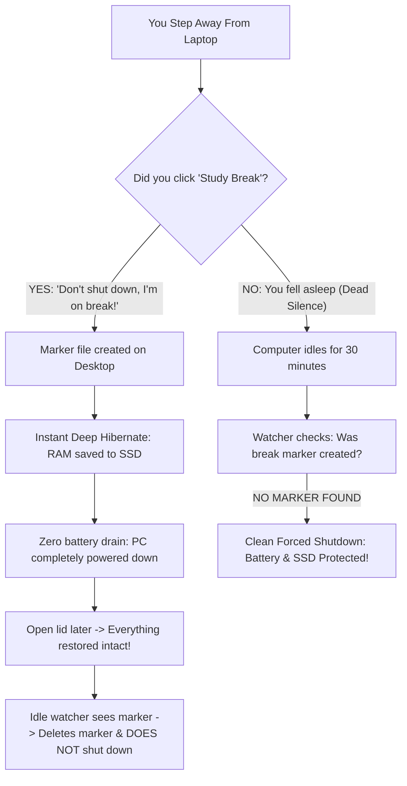

<div align="center">

# 🛡️ SlumberGuard

### *Smart Study-Break & Battery-Preserving Idle Sentinel for Windows 11*

[](https://microsoft.com)
[](https://github.com/PowerShell/PowerShell)
[](LICENSE)
[](#)

<p align="center">
  <b>Never wake up to a dead laptop battery or lost study session again.</b><br>
  Differentiates between intentional study breaks and accidentally falling asleep.
</p>

[Key Features](#-key-features) • [How It Works](#-how-it-works) • [Quick Installation](#-quick-installation) • [Usage](#-usage) • [FAQ](#-frequently-asked-questions) • [Uninstallation](#-uninstallation)

</div>

---

## ⚡ The Big Idea: A "Dead Man's Switch" for Late-Night Studying

Think of **SlumberGuard** as an intelligent safety switch for your laptop:

| Your Action | Laptop's Interpretation | What Happens |
| :--- | :--- | :--- |
| 🟢 **You Click the Button** (or press `Ctrl+Alt+B`) | **"I am on an intentional break — DO NOT shut down my laptop!"** | Instantly saves all your open tabs, notes, and code into **Hibernate**. Zero battery wasted. When you wake it up, your work is 100% untouched. |
| 🔴 **You Do NOTHING** (Accidentally fell asleep) | **"No break signal received and 30m idle — they fell asleep!"** | The background watcher activates after 30 minutes of inactivity and **executes a clean forced shutdown** to protect your battery and SSD. |

---

## 🎯 The Problem SlumberGuard Solves

When studying late at night on a laptop, you face a dilemma:
1. **If you step away for a break**: You don't want Windows auto-closing your 20 research tabs, PDF textbooks, and unsaved code.
2. **If you accidentally fall asleep**: You don't want your laptop burning all night on your bed or desk, killing your battery cycles, overheating, and wearing out hardware.

Standard Windows Sleep is flawed—it wastes 15%–30% of battery overnight keeping RAM powered. Automatic shutdown timers are too aggressive—they kill your tabs even when you just stepped away for coffee.

**SlumberGuard gives you the best of both worlds with zero friction.**



---

## ✨ Key Features

- **🚀 One-Click / Hotkey Hibernation**: Hit **`Ctrl + Alt + B`** or double-click the **Study Break** icon to safely hibernate in under 3 seconds.
- **⚡ 100% Session Preservation**: Open browser tabs, unsaved notes, and workspaces are stored safely in disk hibernation (`hiberfil.sys`) with zero battery draw.
- **🛡️ Accidental Sleep Protection**: If you fall asleep and leave the PC idle for 30 minutes, SlumberGuard executes a clean forced shutdown (`shutdown /s /f /t 0`).
- **☁️ Cloud & OneDrive Aware**: Automatically detects both native and OneDrive-redirected Windows 11 Desktop environments.
- **🔋 Battery-Aware Execution**: Bypasses Windows Task Scheduler's default limitation to ensure idle protection triggers even on battery power.
- **🔕 Completely Silent**: Runs background checks without flashing intrusive command prompt boxes or console windows.

---

## 📦 Project Structure

```text
SlumberGuard/
├── StudyBreak.ps1              # Core logic: Creates break marker & hibernates
├── StudyBreak.bat              # Standalone batch launcher
├── IdleMistakeDetector.ps1     # 30-minute idle watcher & safety shutdown engine
├── Install-StudySafetySystem.ps1 # Automated installer (configures Task Scheduler & Desktop icon)
├── Uninstall-StudySafetySystem.ps1 # One-click removal script
└── README.md                   # Documentation
```

---

## 🚀 Quick Installation

### Option 1: Automated 1-Command Setup (Recommended)

1. Clone or download this repository.
2. Open **PowerShell as Administrator** (`Win + X` $\rightarrow$ **Terminal (Admin)**).
3. Navigate to the folder and run:

```powershell
Set-ExecutionPolicy -Scope Process -ExecutionPolicy Bypass
.\Install-StudySafetySystem.ps1
```

The installer will automatically:
- Enable Windows Deep Hibernation (`powercfg /hibernate on`).
- Create a dedicated **Study Break** icon on your Desktop with the hotkey **`Ctrl + Alt + B`**.
- Register the 30-minute idle detector in Windows Task Scheduler with full battery support.

---

### Option 2: Manual Setup via Windows Task Scheduler

<details>
<summary>Click to view manual step-by-step instructions</summary>

1. **Enable Hibernation**:
   Run in Admin Terminal: `powercfg /hibernate on`
2. **Create Desktop Shortcut**:
   - Right-click Desktop $\rightarrow$ **New** $\rightarrow$ **Shortcut**.
   - Location: `powershell.exe -NoProfile -ExecutionPolicy Bypass -WindowStyle Hidden -File "C:\Path\To\StudyBreak.ps1"`
   - Name it `Study Break` and pick an icon from `shell32.dll`.
3. **Register Task Scheduler**:
   - Open `taskschd.msc`.
   - **General**: Name: `IdleMistakeDetector` • Select *Run only when user is logged on* • Check *Run with highest privileges*.
   - **Triggers**: New $\rightarrow$ Begin the task: *On idle*.
   - **Actions**: Start a program $\rightarrow$ `powershell.exe` $\rightarrow$ Arguments: `-NoProfile -ExecutionPolicy Bypass -WindowStyle Hidden -File "C:\Path\To\IdleMistakeDetector.ps1"`.
   - **Conditions**: 
     - *Start the task only if computer is idle for:* **30 minutes**.
     - **Uncheck** *Start the task only if computer is on AC power* (ensures laptop works on battery).
   - Click **OK**.

</details>

---

## 🎮 Usage

### Scenario A: Taking an Intentional Break
1. When you step away from your desk, do either:
   - **Double-click** the **Study Break** desktop shortcut, OR
   - Press **`Ctrl + Alt + B`** on your keyboard.
2. Your laptop enters deep hibernation. All your browser tabs, PDFs, and code stay intact.
3. When you open the lid later, everything is right where you left it.

### Scenario B: Accidentally Falling Asleep
1. You fall asleep while studying without hitting the button.
2. After **30 minutes of no mouse/keyboard activity**, the background watcher runs.
3. It detects that no intentional study marker exists.
4. It performs a clean, forced shutdown to protect your battery and hardware.

---

## ⚙️ Customization

Want to change the idle duration (e.g. to 20 or 45 minutes)?

1. Press `Win + R`, type `taskschd.msc`, and press **Enter**.
2. Locate `IdleMistakeDetector` in the Task Scheduler Library.
3. Right-click $\rightarrow$ **Properties** $\rightarrow$ **Conditions** tab.
4. Modify **Start the task only if the computer is idle for:** to your preferred duration.

---

## ❓ Frequently Asked Questions

#### Q: Do I need to double-click the shortcut?
**A:** Yes, like standard Windows desktop shortcuts, it opens with a double-click. **Pro Tip:** You can also press **`Ctrl + Alt + B`** from anywhere, or right-click the shortcut and select **Pin to Taskbar** for a single-click button!

#### Q: Why Hibernate instead of Sleep?
**A:** Standard Sleep continues drawing battery to keep RAM active (wasting 15%–30% overnight and keeping the laptop warm in a backpack). Hibernate dumps RAM state directly to your SSD and drops power consumption to **absolute zero**.

#### Q: Will this close my unsaved files if I fall asleep?
**A:** If you fall asleep without hitting the break button, it executes `shutdown /s /f /t 0` to preserve the hardware. We strongly recommend using browser session restore (Chrome/Edge $\rightarrow$ *"Continue where you left off"*) and Auto-Save in your text editors (VS Code, Word, etc.).

---

## 🗑️ Uninstallation

To cleanly remove the shortcut and scheduled task:
1. Open **PowerShell as Administrator**.
2. Run:
```powershell
.\Uninstall-StudySafetySystem.ps1
```

---

## 📄 License

Distributed under the [MIT License](LICENSE). Free to use, modify, and distribute.
