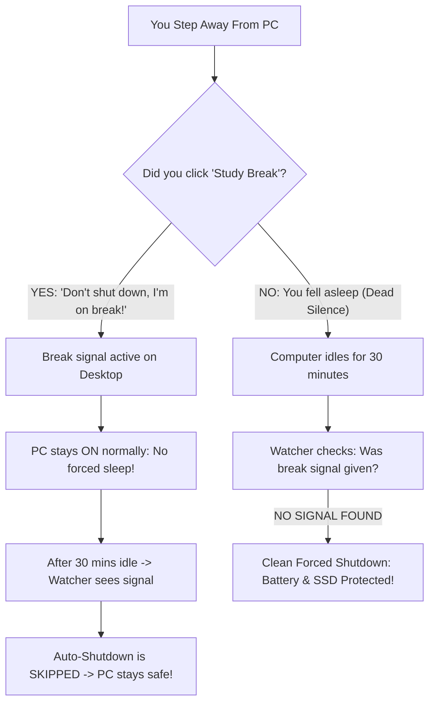

<div align="center">


# 🛡️ SleepSafe

### *Smart Study-Break & Battery-Preserving Idle Sentinel for Windows 11*

[](https://microsoft.com)
[](https://github.com/PowerShell/PowerShell)
[](LICENSE)
[](https://github.com/OFFICIAL-ZXKTS/SlumberGuard)

<p align="center">
  <b>Never wake up to a dead laptop battery or lost study session again.</b><br>
  Differentiates between intentional study breaks and accidentally falling asleep.
</p>

[Key Features](#-key-features) • [How It Works](#-how-it-works) • [Desktop Icon](#-custom-desktop-icon) • [Quick Installation](#-quick-installation) • [Usage](#-usage) • [FAQ](#-frequently-asked-questions) • [Uninstallation](#-uninstallation)

</div>

---

## ⚡ The Big Idea: A "Dead Man's Switch" for Late-Night Studying

Think of **SleepSafe** as an intelligent safety switch for your **PC**:

| Your Action | Laptop's Interpretation | What Happens |
| :--- | :--- | :--- |
| 🟢 **You Click the Button** (or press `Ctrl+Alt+B`) | **"I am on an intentional break — DO NOT shut down my PC!"** | Sends the break signal. Your PC **stays ON and active** (does not force sleep), but the 30-minute auto-shutdown is **PAUSED**. Your downloads and music keep running safely. |
| 🔴 **You Do NOTHING** (Accidentally fell asleep) | **"No break signal received and 30m idle — user fell asleep!"** | The background watcher activates after 30 minutes of complete inactivity and **executes a clean forced shutdown** to protect your battery and SSD. |

---

## 🎯 The Problem SleepSafe Solves

When working late on your PC, you face a dilemma:
1. **If you step away for a break**: You want your computer to stay on and active without Windows auto-shutting down your 20 research tabs, background tasks, or unsaved work.
2. **If you accidentally fall asleep**: You don't want your laptop/PC burning all night on your bed or desk, draining battery cycles, overheating, and wearing out hardware.

**SleepSafe gives you the best of both worlds with zero friction.**



---

## ✨ Key Features

- **🚀 One-Click / Hotkey Immunity**: Hit **`Ctrl + Alt + B`** or double-click the **Study Break** icon to toggle Break Mode.
- **⚡ Zero Interruption**: Keeps your background music, downloads, and workspace running without forced sleep mode.
- **🛡️ Accidental Sleep Protection**: If you fall asleep and leave the PC idle for 30 minutes, SleepSafe executes a clean forced shutdown (`shutdown /s /f /t 0`).
- **☁️ Cloud & OneDrive Aware**: Automatically detects both native and OneDrive-redirected Windows 11 Desktop environments.
- **🔋 Battery-Aware Execution**: Bypasses Windows Task Scheduler's default limitation to ensure idle protection triggers even on battery power.
- **🔕 Completely Silent**: Runs background checks without flashing intrusive command prompt boxes or console windows.

---

## 📦 Project Structure

```text
SleepSafe/
├── assets/
│   ├── icon.png                # High-res 3D preview logo
│   └── icon.ico                # Windows 256x256 desktop shortcut icon
├── StudyBreak.ps1              # Core logic: Signals break mode & pauses shutdown
├── StudyBreak.bat              # Standalone batch launcher
├── IdleMistakeDetector.ps1     # 30-minute idle watcher & safety shutdown engine
├── Install-StudySafetySystem.ps1 # Automated installer (configures Task Scheduler & custom icon)
├── Reinstall.bat               # 1-click self-elevating reinstaller
├── Uninstall-StudySafetySystem.ps1 # One-click removal script
├── LICENSE                     # Official Apache 2.0 License
└── README.md                   # Documentation
```

---

## 🎨 Custom Desktop Icon

SleepSafe includes a custom-designed 3D app icon representing late-night study and sleep safety:

<div align="center">
  <br>
  <sub><b>assets/icon.ico</b> (256x256 high-resolution Windows icon)</sub>
</div>

### How the icon is applied:
- **Automatic:** Running `Install-StudySafetySystem.ps1` or double-clicking `Reinstall.bat` automatically binds `assets\icon.ico` to your Desktop shortcut!
- **Manual (Optional):**
  1. Right-click the **Study Break** shortcut on your Desktop $\rightarrow$ select **Properties**.
  2. Under the **Shortcut** tab, click **Change Icon...**.
  3. Click **Browse...** $\rightarrow$ choose `assets\icon.ico` from your SleepSafe folder.
  4. Click **OK** $\rightarrow$ **Apply**.

---

## 🚀 Quick Installation

### Option 1: Automated 1-Command Setup (Recommended)

1. Clone or download this repository.
2. Open **PowerShell as Administrator** (`Win + X` $\rightarrow$ **Terminal (Admin)**).
3. Navigate to your SleepSafe folder and run:

```powershell
Set-ExecutionPolicy -Scope Process -ExecutionPolicy Bypass
.\Install-StudySafetySystem.ps1
```

The installer will automatically:
- Enable Windows Deep Hibernation (`powercfg /hibernate on`).
- Create your **Study Break** Desktop icon with the custom 3D icon and `Ctrl + Alt + B` hotkey.
- Register the 30-minute idle detector in Windows Task Scheduler with full battery support.

---

### Option 2: Manual Setup via Windows Task Scheduler

<details>
<summary>Click to view manual step-by-step instructions</summary>

1. **Enable Hibernation**:
   Run in Admin Terminal: `powercfg /hibernate on`
2. **Create Desktop Shortcut**:
   - Right-click Desktop $\rightarrow$ **New** $\rightarrow$ **Shortcut**.
   - Location: `powershell.exe -NoProfile -ExecutionPolicy Bypass -WindowStyle Hidden -File "%USERPROFILE%\Downloads\Shutdown\StudyBreak.ps1"`
   - Name it `Study Break` and select the icon from `assets\icon.ico`.
3. **Register Task Scheduler**:
   - Open `taskschd.msc`.
   - **General**: Name: `IdleMistakeDetector` • Select *Run only when user is logged on* • Check *Run with highest privileges*.
   - **Triggers**: New $\rightarrow$ Begin the task: *On idle*.
   - **Actions**: Start a program $\rightarrow$ `powershell.exe` $\rightarrow$ Arguments: `-NoProfile -ExecutionPolicy Bypass -WindowStyle Hidden -File "%USERPROFILE%\Downloads\Shutdown\IdleMistakeDetector.ps1"`.
   - **Conditions**: 
     - *Start the task only if computer is idle for:* **30 minutes**.
     - **Uncheck** *Start the task only if computer is on AC power* (ensures protection works on battery).
   - Click **OK**.

</details>

---

## 🎮 Usage

### Scenario A: Taking an Intentional Break
1. When you step away from your desk, do either:
   - **Double-click** the **Study Break** desktop shortcut, OR
   - Press **`Ctrl + Alt + B`** on your keyboard.
2. A popup confirms: *"Study Break Activated! Auto-shutdown is PAUSED."*
3. Your PC stays ON normally with no forced sleep. After 30 minutes of idle time, the background watcher sees your break signal and skips shutdown.
4. When you return, click the button again to resume standard protection.

### Scenario B: Accidentally Falling Asleep
1. You fall asleep while studying without hitting the break button.
2. After **30 minutes of no mouse/keyboard activity**, the background watcher runs.
3. It detects that no intentional break signal exists.
4. It performs a clean, forced shutdown to protect your battery and hardware.

---

## ⚙️ Customization

Want to change the idle duration (e.g. to 20 or 45 minutes)?

1. Press `Win + R`, type `taskschd.msc`, and press **Enter**.
2. Locate `IdleMistakeDetector` in the Task Scheduler Library.
3. Right-click $\rightarrow$ **Properties** $\rightarrow$ **Conditions** tab.
4. Modify **Start the task only if the computer is idle for:** to your preferred duration.

---

## ❓ Frequently Asked Questions

#### Q: Do I need to double-click the shortcut?
**A:** Yes, like standard Windows desktop shortcuts, it opens with a double-click. **Pro Tip:** You can also press **`Ctrl + Alt + B`** from anywhere, or right-click the shortcut and select **Pin to Taskbar** for a single-click button!

#### Q: Why Hibernate instead of Sleep?
**A:** Standard Sleep continues drawing battery to keep RAM active (wasting 15%–30% overnight and keeping the laptop warm in a backpack). Hibernate dumps RAM state directly to your SSD and drops power consumption to **absolute zero**.

#### Q: Will this close my unsaved files if I fall asleep?
**A:** If you fall asleep without hitting the break button, it executes `shutdown /s /f /t 0` to preserve the hardware. We strongly recommend using browser session restore (Chrome/Edge $\rightarrow$ *"Continue where you left off"*) and Auto-Save in your text editors (VS Code, Word, etc.).

---

## 🗑️ Uninstallation

To cleanly remove the shortcut and scheduled task:
1. Open **PowerShell as Administrator**.
2. Run:
```powershell
.\Uninstall-StudySafetySystem.ps1
```

---

## 📄 License
 
Distributed under the **[Apache License 2.0](LICENSE)**. Includes patent grants, contributor terms, and trademark protection. Free for personal and commercial use.
