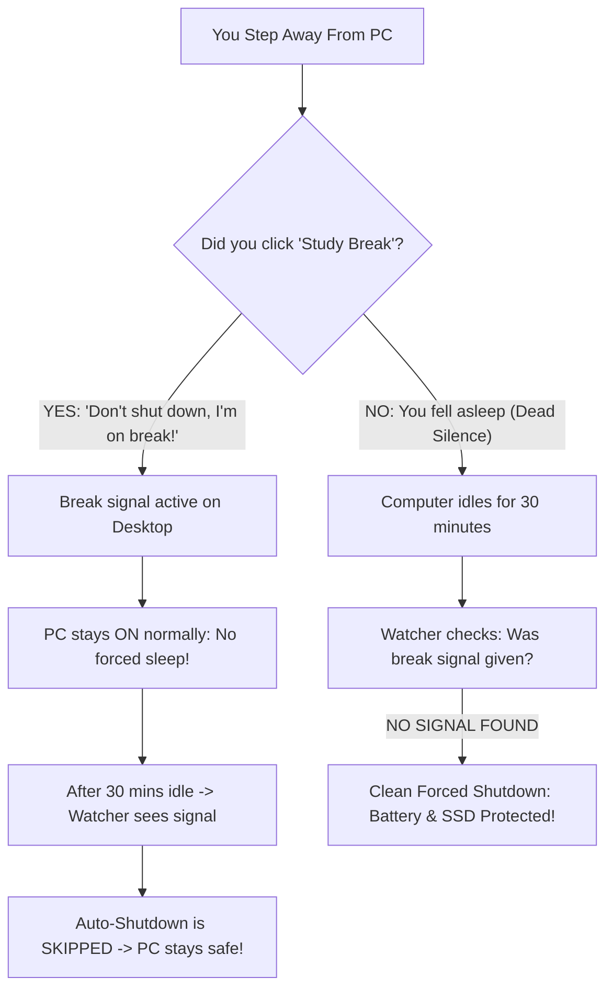

<p align="center">
  <picture>
    <source media="(prefers-color-scheme: dark)" srcset="assets/wordmark-dark.svg">
    <source media="(prefers-color-scheme: light)" srcset="assets/wordmark-light.svg">
    
  </picture>
</p>

<h1 align="center">NightWatch</h1>
<p align="center">A smart study-break sentinel and battery-preserving idle safety system for Windows 11.</p>

<p align="center">
  <a href="https://microsoft.com"></a>
  <a href="https://github.com/PowerShell/PowerShell"></a>
  <a href="LICENSE"></a>
  <a href="https://github.com/OFFICIAL-ZXKTS/NightWatch"></a>
</p>

<p align="center">
  <b>Never wake up to a dead laptop battery or lost study session again.</b><br>
  Differentiates between intentional study breaks and accidentally falling asleep.
</p>

<p align="center">
  <a href="#-key-features">Key Features</a> •
  <a href="#-how-it-works">How It Works</a> •
  <a href="#-quick-installation">Quick Installation</a> •
  <a href="#-usage">Usage</a> •
  <a href="#-custom-desktop-icon">Desktop Icon</a> •
  <a href="#-frequently-asked-questions">FAQ</a> •
  <a href="#-uninstallation">Uninstallation</a>
</p>

---

## ⚡ The Big Idea: A "Dead Man's Switch" for Late-Night Studying

Think of **NightWatch** as an intelligent safety switch for your **PC**:

| Your Action | Laptop's Interpretation | What Happens |
| :--- | :--- | :--- |
| 🟢 **You Click the Button** (or press `Ctrl+Alt+B`) | **"I am on an intentional break — DO NOT shut down my PC!"** | Sends the break signal. Your PC **stays ON and active** (does not force sleep), but the 30-minute auto-shutdown is **PAUSED**. Your downloads and music keep running safely. |
| 🔴 **You Do NOTHING** (Accidentally fell asleep) | **"No break signal received and 30m idle — user fell asleep!"** | The background watcher activates after 30 minutes of complete inactivity and **executes a clean forced shutdown** to protect your battery and SSD. |

---

## 🎯 The Problem NightWatch Solves

When working late on your PC, you face a dilemma:
1. **If you step away for a break**: You want your computer to stay on and active without Windows auto-shutting down your 20 research tabs, background tasks, or unsaved work.
2. **If you accidentally fall asleep**: You don't want your laptop/PC burning all night on your bed or desk, draining battery cycles, overheating, and wearing out hardware.

**NightWatch gives you the best of both worlds with zero friction.**



---

## ✨ Key Features

- **🎯 True 30-Minute Physical Idle Tracking**: Uses Win32 `GetLastInputInfo` to measure exact keyboard and mouse idle time. Immune to Windows 11 false alarms (no more premature shutdowns at 10 minutes when your screen dims!).
- **🔊 30-Second Warning Beep Countdown**: Plays audible warning beeps before shutting down. Moving the mouse or tapping any key during the beeps instantly aborts the shutdown!
- **☕ Bulletproof Break Mode**: Toggle on break mode with **`Ctrl + Alt + B`** or by double-clicking the custom icon. Immune to rapid double-clicks (debounce guard), keeps PC alive throughout your break, and auto-resumes protection once you return and type.
- **🛡️ Accidental Sleep Defense**: If you truly fall asleep with no break active, NightWatch executes a clean forced shutdown (`shutdown /s /f /t 0`) to protect your battery and SSD.
- **☁️ Cloud & OneDrive Aware**: Automatically detects both native and OneDrive-redirected Windows 11 Desktop environments.
- **🔋 Full Battery & AC Support**: Configured to run whether on laptop battery or plugged into wall power.
- **⚙️ Purely Administrative & 100% Silent**: Runs elevated in the background via `SilentRunner.vbs` with zero console pop-ups, zero focus stealing, and zero desktop flickering.

---

## 📦 Project Structure

```text
NightWatch/
├── assets/
│   ├── wordmark-dark.svg       # 3D ANSI shadow typography wordmark (dark mode)
│   ├── wordmark-light.svg      # 3D ANSI shadow typography wordmark (light mode)
│   ├── icon.ico                # Windows 256x256 desktop shortcut icon
│   └── icon.png                # High-res desktop icon preview
├── StudyBreak.ps1              # Core logic: Signals break mode & pauses shutdown
├── StudyBreak.bat              # Standalone batch launcher
├── IdleMistakeDetector.ps1     # 30-minute idle watcher & safety shutdown engine
├── SilentRunner.vbs            # Zero-window invisible launcher for Task Scheduler
├── Install-StudySafetySystem.ps1 # Automated installer (configures Task Scheduler & custom icon)
├── Reinstall.bat               # 1-click self-elevating reinstaller
├── Uninstall-StudySafetySystem.ps1 # One-click removal script
├── LICENSE                     # Official Apache 2.0 License
└── README.md                   # Documentation
```

---

## 🎨 Custom Desktop Icon

NightWatch includes a custom-designed 3D app icon for your Desktop shortcut:

<div align="center">
  <br>
  <sub><b>assets/icon.ico</b> (256x256 high-resolution Windows icon)</sub>
</div>

### How the icon is applied:
- **Automatic:** Running `Install-StudySafetySystem.ps1` or double-clicking `Reinstall.bat` automatically binds `assets\icon.ico` to your Desktop shortcut!
- **Manual (Optional):**
  1. Right-click the **Study Break** shortcut on your Desktop $\rightarrow$ select **Properties**.
  2. Under the **Shortcut** tab, click **Change Icon...**.
  3. Click **Browse...** $\rightarrow$ choose `assets\icon.ico` from your NightWatch folder.
  4. Click **OK** $\rightarrow$ **Apply**.

---

## 🚀 Quick Installation

### Option 1: Automated 1-Command Setup (Recommended)

1. Clone or download this repository.
2. Open **PowerShell as Administrator** (`Win + X` $\rightarrow$ **Terminal (Admin)**).
3. Navigate to your NightWatch folder and run:

```powershell
Set-ExecutionPolicy -Scope Process -ExecutionPolicy Bypass
.\Install-StudySafetySystem.ps1
```

The installer will automatically:
- Enable Windows Deep Hibernation (`powercfg /hibernate on`).
- Create your **Study Break** Desktop icon with the custom 3D icon and `Ctrl + Alt + B` hotkey.
- Register the 30-minute idle detector in Windows Task Scheduler with full battery support and 100% silent execution.

---

### Option 2: Manual Setup via Windows Task Scheduler

<details>
<summary>Click to view manual step-by-step instructions</summary>

1. **Enable Hibernation**:
   In an *Administrator* PowerShell or cmd: `powercfg /hibernate on`
2. **Create the Desktop Shortcut**:
   - Right-click Desktop $\rightarrow$ **New** $\rightarrow$ **Shortcut**.
   - Location: `powershell.exe -NoProfile -ExecutionPolicy Bypass -WindowStyle Hidden -File "%USERPROFILE%\Downloads\Shutdown\StudyBreak.ps1"`
   - (Optional) set *Change Icon* to `assets\icon.ico`.
   - Name the shortcut `Study Break`.
3. **Register the scheduled task**:
   - Open `taskschd.msc` $\rightarrow$ **Create Task...** (not "Create Basic Task").
   - **General** tab:
     - **Name**: `SleepSafeSentinel`
     - Select *Run only when user is logged on*
     - Check *Run with highest privileges*
   - **Triggers** tab $\rightarrow$ **New...**:
     - Begin the task: *On a schedule* $\rightarrow$ *Daily*
     - **Advanced settings**: check *Repeat task every:* `2 minutes`, for a *duration of:* `Indefinitely`.
   - **Actions** tab $\rightarrow$ **New...**:
     - Action: *Start a program*
     - Program/script: `wscript.exe`
     - Add arguments: `"%USERPROFILE%\Downloads\Shutdown\SilentRunner.vbs"`
   - **Conditions** tab:
     - **Uncheck** *Start the task only if the computer is on AC power* (ensures protection works on battery).
   - Click **OK**.

</details>

---

## 🎮 Usage

### Scenario A: Taking an Intentional Break
1. When you step away from your desk, do either:
   - **Double-click** the **Study Break** desktop shortcut, OR
   - Press **`Ctrl + Alt + B`** on your keyboard.
2. A popup confirms: *"Study Break Activated! Auto-shutdown is PAUSED."*
3. Your PC stays ON normally with no forced sleep. After 30 minutes of idle time, the background watcher sees your break signal and skips shutdown.
4. When you come back, click the button again to toggle break mode OFF, or continue working.

### Scenario B: Accidentally Falling Asleep
1. You fall asleep while studying without hitting the break button.
2. After **30 minutes of no mouse/keyboard activity**, the background watcher runs.
3. It detects that no intentional break signal exists.
4. It sounds a **30-second warning beep countdown**. Touching the mouse or keyboard cancels it immediately.
5. If ignored for 30 seconds, it performs a clean, forced shutdown to protect your battery and hardware.

---

## ⚙️ Customization

Want to change the idle duration (e.g. to 20 or 45 minutes)?

The 30-minute idle threshold is set directly in `IdleMistakeDetector.ps1`:

```powershell
$targetIdleSeconds = 1800   # 30 minutes
```

1. Open `IdleMistakeDetector.ps1` in any text editor (Notepad, VS Code, etc.).
2. Change `1800` to your preferred value in seconds:
   - `1200` = 20 minutes
   - `2700` = 45 minutes
   - `3600` = 1 hour
3. Save the file.
4. Double-click `Reinstall.bat` so the change takes effect.

---

## ❓ Frequently Asked Questions

#### Q: Do I need to double-click the shortcut?
**A:** Yes, like standard Windows desktop shortcuts, it opens with a double-click. **Pro Tip:** You can also press **`Ctrl + Alt + B`** from anywhere, or right-click the shortcut and select **Pin to Taskbar** for a single-click button!

#### Q: Why Hibernate instead of Sleep?
**A:** Standard Sleep continues drawing battery to keep RAM active (wasting 15%–30% overnight and keeping the laptop warm in a backpack). Hibernate dumps RAM state directly to your SSD and drops power consumption to **absolute zero**.

#### Q: Will this close my unsaved files if I fall asleep?
**A:** If you fall asleep without hitting the break button, it executes `shutdown /s /f /t 0` to preserve the hardware. We strongly recommend using browser session restore (Chrome/Edge $\rightarrow$ *"Continue where you left off"*) and Auto-Save in your text editors (VS Code, Word, etc.).

---

## 🗑️ Uninstallation

To cleanly remove the shortcut and scheduled task:
1. Open **PowerShell as Administrator**.
2. Navigate to your repository folder.
3. Run:
```powershell
.\Uninstall-StudySafetySystem.ps1
```

---

## 📄 License

Distributed under the **[Apache License 2.0](LICENSE)**. Includes patent grants, contributor terms, and trademark protection. Free for personal and commercial use.
